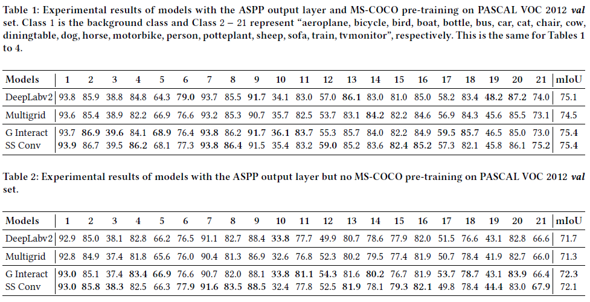
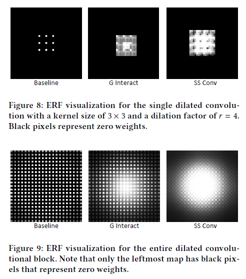

# Efficient Smoothing of Dilated Convolutions for Image Segmentation
This is the code for reproducing the experiments of our project *Efficient Smoothing of Dilated Convolutions for Image Segmentation*. The code is based on the source code of the paper [Smoothed Dilated Convolutions for Improved Dense Prediction](http://www.kdd.org/kdd2018/accepted-papers/view/smoothed-dilated-convolutions-for-improved-dense-prediction), see original README below.


## Authors
* Konstantin Donhauser [donhausk at ethz.ch]
* Manuel Fritsche [manuelf at ethz.ch]
* Lorenz Kuhn [kuhnl at ethz.ch]
* Thomas Ziegler [zieglert at ethz.ch]

## Changes compare to source Repo
* Addition of our proposed pre-filters:
   

   We added our proposed pre-filters (*Average*, *Gaussian*, and an *Aggregation* of them) in the ```dilated.py``` file. Small changes also in the ```network.py``` and ```model.py``` file
* Add training/validation iterations

   Add the possibility for cyclig training and validation. The model is trained for a certain number of steps, afterwards the validation is performed. This will be iterated until the defined number of iterations is reached.
   Changes made in ```model.py``` and changes as well as new configuration parameter in ```main.py```.
   
* Extend the logging to Tensorboard

   During training and at the end of each validation the IoU per class and the mean IoU (mIoU) are logged to be viewd in TensorBoard. Changes performed in ```model.py```.
   
* Scripts for easy using on ETHZ's Leonhard cluster 

   With the command ```source setup.sh``` one can set the parameters for the PASCAL VOC 2012 dataset.
   
   With the command ```source setup.sh cityscapes``` one can set the parameters for the Cityscapes dataset.
   
   With the command ```sh train.sh``` one can start the training/validation. (Ensure that the datasets are located at the path defined in setup.sh)
   
   With the command ```sh clear.sh``` one can clean the workspace after an training/validation. All important log files will be combined in a tar file.

## How to run
* Clone this Repo

* Download the needed models and data sets 

   The [VOC_and_refModel](https://polybox.ethz.ch/index.php/s/6JpwFPdt4dIDMf2) file contains the augmented PASCAL VOC 2012 dataset and the pre-trained deeplabv2 models.
   
   The [Cityscapes](https://polybox.ethz.ch/index.php/s/xxOtMP63jZprmr7) file contains the Cityscapes dataset.
   
   
* Select desired pre-filter

   Select desired pre-filter in ```main.py```. Default filter is our proposed *Average* filter. If one chooses *Aggregation* the batch size has to be reduced in the ```setup.sh``` file. Furthermore make sure that the files of the pre-trained models are located as defined in the ```main.py``` file (*pretrain_file* and *checkpoint_file* parameter).  
   
* Source your workspace

   Use the script  ```setup.sh``` to source the workspace. Make sure that either the datasets are at the locations specified in the file or change the file accordingly. Use command ```source setup.sh``` or ```source setup.sh cityscapes```. 
   
   
* Start the training

   With ```sh train.sh``` one can start to train the model. For experiments on the Cityscapes dataset the time limits in the *bsub* command need to be increased e.g. *-W 92:00*. Change ```train.sh``` file accordingly. (If one does not run on ETHZ's Leonhard cluster one can start the training with ```python main.py --option=train_test```. One might want to clean the folder beforehand as its done in the ```train.sh``` file.)

   
   During the training the current *loss* and *mIoU* for each training step is written to the ```log.txt``` file. This helps to detect numerical instabilities (e.g. exploding of the loss) early. The validation results after each iteration are also written into the ```log.txt``` file.

* Collect results

   After the training is finished one can collect all relevant files by running ```sh clear.sh```. The collection is moved to the home folder ```~/```. 

## README of the source Repo 
***

># Smoothed Dilated Convolutions for Improved Dense Prediction
>
>This is the code for reproducing experimental results in our paper [Smoothed Dilated Convolutions for Improved Dense Prediction](http://www.kdd.org/kdd2018/accepted-papers/view/smoothed-dilated-convolutions-for-improved-dense-prediction) accepted for long presentation in KDD2018. 
>
>Created by [Zhengyang Wang](http://www.linkedin.com/in/zhengyangwang1991) and [Shuiwang Ji](http://https://www.linkedin.com/in/shuiwang-ji-9a040715/) at Texas A&M University.
>
>In this work, we propose smoothed dilated convolutions to address the gridding artifacts caused by dilated convolutions. Some results are shown below. Our methods improve the image semantic segmentation models, with only hundreds of extra training parameters. More details and experimental results will be added once the paper is published.
>
>## Citation
>If using this code , please cite our paper.
>```
>@inproceedings{wang2018smoothed,
>  title={Smoothed Dilated Convolutions for Improved Dense Prediction},
>  author={Wang, Zhengyang and Ji, Shuiwang},
>  booktitle={Proceedings of the 24th ACM SIGKDD International Conference on Knowledge Discovery \& Data Mining},
>  pages={2486--2495},
>  year={2018},
>  organization={ACM}
>}
>```
>
>## Results
>**PASCAL mIoU**:
>
>
>We perform the effective receptive field analysis to visualize the smoothing effect.
>
>**Effective Receptive Field Analysis**:
>
>
>f
>## Introduction
>The baseline is an (re-)implementation of [DeepLab v2 (ResNet-101)](http://liangchiehchen.com/projects/DeepLabv2_resnet.html) in TensorFlow for semantic image segmentation on the [PASCAL VOC 2012 dataset](http://host.robots.ox.ac.uk/pascal/VOC/). We refer to [DrSleep's implementation](https://github.com/DrSleep/tensorflow-deeplab-resnet) (Many thanks!). We do not use tf-to-caffe packages like kaffe so you only need TensorFlow 1.3.0+ to run this code.
>
>The deeplab pre-trained ResNet-101 ckpt files (pre-trained on MSCOCO) are provided by DrSleep -- [here](https://drive.google.com/drive/folders/0B_rootXHuswsZ0E4Mjh1ZU5xZVU). Thanks again!
>
>## Update
>**02/09/2018**:
>* We implement our proposed smoothed dilated convolutions and insert them in the baseline. To use them, simply change 'dilated_type' in main.py.
>
>**02/02/2018**:
>
>* A clarification:
>
>As reported, ResNet pre-trained models (NOT deeplab) from Tensorflow were trained using the channel order RGB instead BGR (https://github.com/tensorflow/models/blob/master/research/slim/preprocessing/vgg_preprocessing.py).
>
>Thus, the most correct way to apply them is to use the same order RGB. The original code is for pre-trained models from Caffe and uses BGR. To correct this, when you use [res101](http://download.tensorflow.org/models/resnet_v1_101_2016_08_28.tar.gz) and [res50](http://download.tensorflow.org/models/resnet_v1_50_2016_08_28.tar.gz), you need to delete [line 116](https://github.com/zhengyang-wang/Deeplab-v2--ResNet-101--Tensorflow/blob/1b449b22a0729767b370c68a2848fda9caeed510/utils/image_reader.py#L116) and [line 117](https://github.com/zhengyang-wang/Deeplab-v2--ResNet-101--Tensorflow/blob/1b449b22a0729767b370c68a2848fda9caeed510/utils/image_reader.py#L117) in utils/image_reader.py to remove the RGB to BGR step when reading images. Then, modify [line 77](https://github.com/zhengyang-wang/Deeplab-v2--ResNet-101--Tensorflow/blob/1b449b22a0729767b370c68a2848fda9caeed510/utils/label_utils.py#L77) in utils/label_utils.py to remove the BGR to RGB step in the inverse process for image visualization. At last, you need to change the IMAGE_MEAN by swapping the first and the third values in [line 26](https://github.com/zhengyang-wang/Deeplab-v2--ResNet-101--Tensorflow/blob/1b449b22a0729767b370c68a2848fda9caeed510/model.py#L26) and [line 26](https://github.com/zhengyang-wang/Deeplab-v2--ResNet-101--Tensorflow/blob/1b449b22a0729767b370c68a2848fda9caeed510/model_msc.py#L26) for non_msc and msc training, respectively.
>
>However, this change actually does not affect the performance a lot, proved by discussion in [issue 30](https://github.com/zhengyang-wang/Deeplab-v2--ResNet-101--Tensorflow/issues/30). In this task, the size of training patches is different from that in ImageNet. And the set of images is different. The IMAGE_MEAN is never accurate. I guess that simply using IMAGE_MEAN=[127.5, 127.5, 127.5] will work as well.
>
>**12/13/2017**:
>
>* Now the test code will output the mIoU as well as the IoU for each class.
>
>**12/12/2017**:
>
>* Add 'predict' function, you can use '--option=predict' to save your outputs now (both the true prediction where each pixel is between 0 and 20 and the visual one where each class has its own color).
>
>* Add multi-scale training, testing and predicting. Check main_msc.py and model_msc.py and use them just as main.py and model.py.
>
>* Add plot_training_curve.py to use the log.txt to make plots of training curve.
>
>* Now this is a 'full' (re-)implementation of [DeepLab v2 (ResNet-101)](http://liangchiehchen.com/projects/DeepLabv2_resnet.html) in TensorFlow. Thank you for the support. You are welcome to report your settings and results as well as any bug!
>
>**11/09/2017**:
>
>* The new version enables using original ImageNet pre-trained ResNet models (without pre-training on MSCOCO). You may change arguments ('encoder_name' and 'pretrain_file') in main.py to use corresponding pre-trained models. The original pre-trained ResNet-101 ckpt files are provided by tensorflow officially -- [res101](http://download.tensorflow.org/models/resnet_v1_101_2016_08_28.tar.gz) and [res50](http://download.tensorflow.org/models/resnet_v1_50_2016_08_28.tar.gz).
>
>* To help those who want to use this model on the CityScapes dataset, I shared the corresponding txt files and the python file which generates them. Note that you need to use tools [here](https://github.com/mcordts/cityscapesScripts) to generate labels with trainID first. Hope it would be helpful. Do not forget to change IMG_MEAN in model.py and other settings in main.py.
>
>* 'is_training' argument is removed and 'self._batch_norm' changes. Basically, for a small batch size, it is better to keep the statistics of the BN layers (running means and variances) frozen, and to not update the values provided by the pre-trained model by setting 'is_training=False'. Note that is_training=False still updates BN parameters gamma (scale) and beta (offset) if they are presented in var_list of the optimiser definition. Set 'trainable=False' in BN fuctions to remove them from trainable_variables.
>
>* Add 'phase' argument in network.py for future development. 'phase=True' means training. It is mainly for controlling batch normalization (if any) in the non-pre-trained part.
>```
>Example: If you have a batch normalization layer in the decoder, you should use 
>
>outputs = self._batch_norm(inputs, name='g_bn1', is_training=self.phase, activation_fn=tf.nn.relu, trainable=True)
>```
>* Some changes to make the code more readable and easy to modify for future research.
>
>* I plan to add 'predict' function to enable saving predicted results for offline evaluation, post-processing, etc.
>
>## System requirement
>
>#### Programming language
>```
>Python 3.5
>```
>#### Python Packages
>```
>tensorflow-gpu 1.3.0
>```
>## Configure the network
>
>All network hyperparameters are configured in main.py.
>
>#### Training
>```
>num_steps: how many iterations to train
>
>save_interval: how many steps to save the model
>
>random_seed: random seed for tensorflow
>
>weight_decay: l2 regularization parameter
>
>learning_rate: initial learning rate
>
>power: parameter for poly learning rate
>
>momentum: momentum
>
>encoder_name: name of pre-trained model: res101, res50 or deeplab
>
>pretrain_file: the initial pre-trained model file for transfer learning
>
>dilated_type: type of dilated conv: regular, decompose, smooth_GI or smooth_SSC
>
>data_list: training data list file
>```
>#### Testing/Validation
>```
>valid_step: checkpoint number for testing/validation
>
>valid_num_steps: = number of testing/validation samples
>
>valid_data_list: testing/validation data list file
>```
>#### Prediction
>```
>out_dir: directory for saving prediction outputs
>
>test_step: checkpoint number for prediction
>
>test_num_steps: = number of prediction samples
>
>test_data_list: prediction data list filename
>
>visual: whether to save visualizable prediction outputs
>```
>#### Data
>```
>data_dir: data directory
>
>batch_size: training batch size
>
>input height: height of input image
>
>input width: width of input image
>
>num_classes: number of classes
>
>ignore_label: label pixel value that should be ignored
>
>random_scale: whether to perform random scaling data-augmentation
>
>random_mirror: whether to perform random left-right flipping data-augmentation
>```
>#### Log
>```
>modeldir: where to store saved models
>
>logfile: where to store training log
>
>logdir: where to store log for tensorboard
>```
>## Training and Testing
>
>#### Start training
>
>After configuring the network, we can start to train. Run
>```
>python main.py
>```
>The training of Deeplab v2 ResNet will start.
>
>#### Training process visualization
>
>We employ tensorboard for visualization.
>
>```
>tensorboard --logdir=log --port=6006
>```
>
>You may visualize the graph of the model and (training images + groud truth labels + predicted labels).
>
>To visualize the training loss curve, write your own script to make use of the training log.
>
>#### Testing and prediction
>
>Select a checkpoint to test/validate your model in terms of pixel accuracy and mean IoU.
>
>Fill the valid_step in main.py with the checkpoint you want to test. Change valid_num_steps and valid_data_list accordingly. Run
>
>```
>python main.py --option=test
>```
>
>The final output includes pixel accuracy and mean IoU.
>
>Run
>
>```
>python main.py --option=predict
>```
>The outputs will be saved in the 'output' folder.
